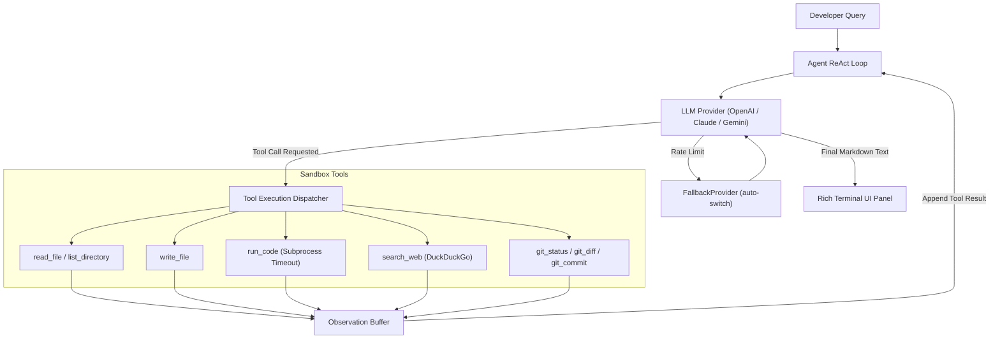

# ⚡ Nexus-Agent: Autonomous Agentic AI Coding Assistant

<div align="center">
  <p><strong>A production-grade, terminal-first AI Software Engineering Companion powered by autonomous ReAct tool loops and multi-provider backend switching.</strong></p>

  
  
  
  
  
  [](https://www.linkedin.com/in/yash-bajpai-b5a86332a/)
  
</div>

---

## 🎬 Live Demo Recording

<!-- Replace the link below with your copied video URL from GitHub -->
(https://github.com/user-attachments/assets/73e78850-8669-40e9-aec3-3a355e975c1f)

---

## 🌟 Overview

**Nexus-Agent** is an autonomous command-line coding agent designed to pair-program with developers directly inside their local workspace. Built from the ground up to showcase modern **Agentic AI Engineering** principles, Nexus-Agent doesn't just generate text—it autonomously inspects files, modifies codebases, executes scripts inside secure local sandboxes, searches live web documentation, and inspects Git repositories.

Built with a clean **ReAct (Reasoning + Acting)** cognitive architecture, Nexus-Agent reasons step-by-step after every tool execution before deciding its next move.

---

## ❓ Why Nexus-Agent?

Unlike cloud-dependent tools like GitHub Copilot CLI, **Nexus-Agent** is built for offline-capable, cost-zero local execution. V2 will integrate a custom-trained 124M parameter LLM as the local backend — enabling completely private, zero-latency execution with no external API key required.

### 📊 How Nexus-Agent Compares

| Feature | Nexus-Agent | Copilot CLI | Cursor | Aider |
| :--- | :---: | :---: | :---: | :---: |
| **Multi-Provider Support** (Claude, Gemini, OpenAI) | ✅ | ❌ | ❌ | ✅ |
| **Auto-Provider Fallback** (rate limit resilient) | ✅ | ❌ | ❌ | ❌ |
| **Autonomous Local Tool Execution** | ✅ | ❌ | ✅ | ✅ |
| **Real-Time Token & Cost Tracking** | ✅ | ❌ | ❌ | ❌ |
| **`@mention` File Context Injection** | ✅ | ❌ | ❌ | ❌ |
| **Smart Project vs. Global Detection** | ✅ | ❌ | ❌ | ❌ |
| **AI-Powered `agent commit`** | ✅ | ❌ | ❌ | ❌ |

---

## 🔥 Key Architectural Highlights

- 🧠 **Autonomous ReAct Loop**: Implements multi-step cognitive reasoning (`Thought → Action → Observation → Repeat`), allowing the agent to solve complex multi-file engineering tasks independently (up to 10 autonomous tool iterations per query).
- 🔌 **Universal Multi-Provider Backend**: Abstracted provider layer supporting seamless switching between industry-leading LLMs (`OpenAI GPT-4o`, `Anthropic claude-sonnet-4-6`, and `Google gemini-2.5-flash`).
- 🔄 **Auto-Provider Fallback**: `--provider auto` chains `gemini → anthropic → openai` and switches silently on rate limit or auth failure, with a clean `[WARN]` message.
- 💰 **Real-Time Dynamic Cost Tracker**: Live token computation engine that calculates exact input/output token expenditure and monetary cost in real time per session.
- 🚀 **First-Run Onboarding Wizard**: Auto-detects first launch, guides through API key setup, detects RAM/CPU/GPU specs, and suggests optimal local model for V2.
- 🛠️ **Comprehensive Developer Toolset**:
  - `read_file`: Safely parses local file contents to prevent hallucinations.
  - `write_file`: Actively writes or overwrites code files with automatic directory creation.
  - `list_directory`: Recursively maps workspace architecture.
  - `run_code`: Executes arbitrary Python code inside isolated subprocesses with strict execution timeout enforcement (`CODE_EXECUTION_TIMEOUT = 10s`).
  - `search_web`: Queries live DuckDuckGo indexes for real-time API docs and error debugging.
  - `git_status`: Monitors uncommitted workspace changes and diff statistics.
  - `git_diff` + `git_commit`: Reads full staged diff and commits — powering `nexus-agent commit`.
- 🎨 **Rich Syntax-Highlighted UI**: Beautiful terminal display powered by `Rich`, featuring markdown rendering and ReAct trace badges (`[THINKING]`, `[ACTION]`, `[OBSERVE]`).
- ⚡ **Streaming CLI Response**: Interactive streaming text output with `--no-stream` toggle support.

---

## 🏗️ System Architecture

```
nexus-agent/
├── pyproject.toml               ← Package metadata & Typer binary entry point (`nexus-agent` / `agent`)
├── requirements.txt             ← Core dependencies (Typer, Rich, OpenAI, Anthropic, Gemini, DDGS)
├── .env.example                 ← Environment variable configuration template
└── src/
    ├── agent/
    │   ├── core.py              ← Autonomous ReAct agent loop & system instructions
    │   ├── memory.py            ← Sliding-window conversation buffer (max 20 turns)
    │   └── tools.py             ← Universal tool schema & execution handlers
    ├── cli/
    │   ├── app.py               ← Typer CLI command definitions (chat, repl, review, debug, generate, commit)
    │   ├── display.py           ← Rich terminal UI components & live cost tracking
    │   └── onboarding.py        ← First-run wizard (API keys, system spec detection, provider setup)
    ├── providers/
    │   ├── base.py              ← Abstract BaseProvider interface & RateLimitError
    │   ├── fallback_provider.py ← Auto-fallback chain (gemini → anthropic → openai)
    │   ├── openai_provider.py   ← OpenAI backend implementation
    │   ├── anthropic_provider.py ← Anthropic claude-sonnet-4-6 backend implementation
    │   └── gemini_provider.py   ← Google gemini-2.5-flash backend implementation
    └── utils/
        └── config.py            ← Environment loader & dynamic token cost calculator
```

### Cognitive ReAct Workflow



---

## 🚀 Getting Started

### 1. Installation

Clone the repository and install the editable package locally:

```bash
git clone https://github.com/Yash1bajpai/nexus-agent.git
cd nexus-agent
pip install -e .
```

### 2. API Key Configuration

Copy the example environment template and add your preferred API keys:

```bash
cp .env.example .env
```

Open `.env` and configure your keys:
```ini
DEFAULT_PROVIDER=gemini
GEMINI_API_KEY=AIzaSy...
ANTHROPIC_API_KEY=sk-ant-...
OPENAI_API_KEY=sk-proj-...
```

> **First run auto-wizard**: On the very first `nexus-agent` launch, an interactive onboarding wizard will guide you through key setup automatically.

### 3. Usage

#### Interactive Multi-Turn REPL Mode (Default)
Start a continuous pair-programming session directly by invoking `nexus-agent` (or `agent`) without any subcommands:

```bash
nexus-agent
# Or with flags: nexus-agent --provider anthropic
# Auto-fallback mode: nexus-agent --provider auto
```

#### Single-Turn Coding (`chat`)
Execute an instant autonomous coding task directly from your terminal:

```bash
nexus-agent chat "Create a python script fib.py that prints the first 10 Fibonacci numbers and run it to verify." --provider openai
```

#### Automated Code Review (`review`)
Inspect local code files for bugs, security vulnerabilities, and clean coding practices:

```bash
nexus-agent review src/utils/config.py --provider gemini
```

#### Autonomous Error Debugging (`debug`)
Feed error tracebacks directly into Nexus-Agent to diagnose root causes and write fixes:

```bash
nexus-agent debug src/app.py --error "AttributeError: 'NoneType' object has no attribute 'stream'"
# With verbose ReAct trace:
nexus-agent debug src/app.py --error "KeyError: 'model'" --verbose
```

#### Direct File Generation (`generate`)
Generate complete code files autonomously and save them to your workspace:

```bash
nexus-agent generate "Create an async web scraper using aiohttp and BeautifulSoup" --output scraper.py
```

#### AI Commit Message (`commit`)
Reads your git diff, generates a meaningful conventional commit message, asks for confirmation, then commits:

```bash
nexus-agent commit
# Skip confirmation prompt:
nexus-agent commit --yes
```

#### Verbose ReAct Trace
See the agent's full reasoning process — thinking, actions, and observations:

```bash
nexus-agent chat "Refactor utils.py to use dataclasses" --verbose
```

Output looks like:
```
[THINKING] I need to read the file first to understand the current structure
[ACTION]   read_file(path="utils.py")
[OBSERVE]  Done (0.1s) → class Config: | def load(): | ...
[THINKING] Now I'll rewrite using dataclasses and write_file
[ACTION]   write_file(path="utils.py", content="...")
[OBSERVE]  Done (0.0s) → Successfully wrote 847 characters to utils.py
```

---

## 🧪 Testing & Verification

Nexus-Agent maintains a **100% passing unit test suite** covering all tool dispatchers, filesystem handlers, UX features, and subprocess safety boundaries:

```bash
pytest tests/ -v
```

```text
============================= test session starts =============================
collecting ... collected 19 items

tests/test_providers.py::test_anthropic_provider_schema PASSED           [  5%]
tests/test_providers.py::test_openai_provider_schema PASSED              [ 10%]
tests/test_providers.py::test_gemini_provider_schema PASSED              [ 15%]
tests/test_providers.py::test_provider_tool_result_format PASSED         [ 21%]
tests/test_tools.py::test_read_file_success PASSED                       [ 26%]
tests/test_tools.py::test_read_file_not_found PASSED                     [ 31%]
tests/test_tools.py::test_list_directory_success PASSED                  [ 36%]
tests/test_tools.py::test_list_directory_not_found PASSED                [ 42%]
tests/test_tools.py::test_search_web PASSED                              [ 47%]
tests/test_tools.py::test_write_file_success PASSED                      [ 52%]
tests/test_tools.py::test_run_code_success PASSED                        [ 57%]
tests/test_tools.py::test_git_status_tool PASSED                         [ 63%]
tests/test_tools.py::test_execute_tool_dispatcher PASSED                 [ 68%]
tests/test_ux_features.py::test_parse_at_mentions PASSED                 [ 73%]
tests/test_ux_features.py::test_smart_startup_project_mode PASSED        [ 78%]
tests/test_ux_features.py::test_status_spinner_helpers PASSED            [ 84%]
tests/test_ux_features.py::test_sqlite_memory PASSED                     [ 89%]

============================= 19 passed in 4.28s ==============================
```

---

## 🛡️ Security & Sandbox Best Practices

- **Strict Secret Exclusion**: Verified `.gitignore` blocks `.env`, `.env.local`, and `.env.*.local`.
- **Subprocess Isolation**: Code execution (`run_code`) runs in dedicated subprocess threads with mandatory timeouts to prevent infinite loops.

---

<div align="center">
  <p>Engineered by <a href="https://github.com/Yash1bajpai">Yash Bajpai</a> · <a href="https://www.linkedin.com/in/yash-bajpai-b5a86332a/">LinkedIn</a></p>
</div>
