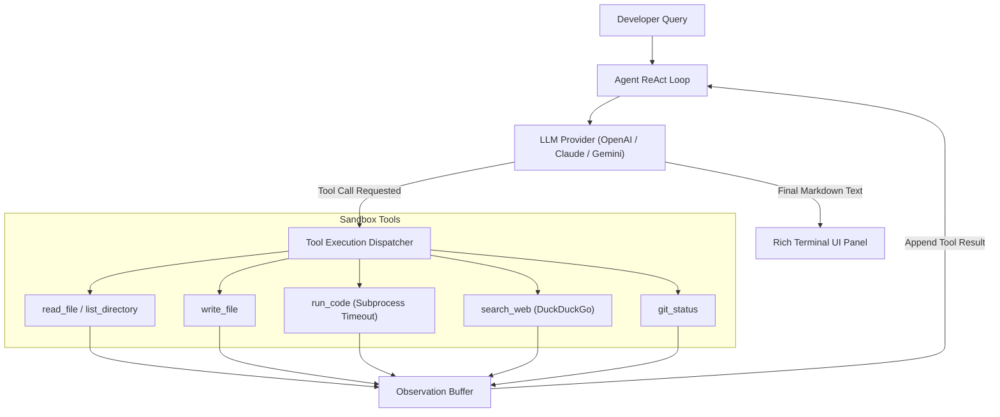

# ⚡ DevMind: Autonomous Agentic AI Coding Assistant

<div align="center">
  <p><strong>A production-grade, terminal-first AI Software Engineering Companion powered by autonomous ReAct tool loops and multi-provider backend switching.</strong></p>

  
  
  
  
  
  
</div>

---

## 🌟 Overview

**DevMind** is an autonomous command-line coding agent designed to pair-program with developers directly inside their local workspace. Built from the ground up to showcase modern **Agentic AI Engineering** principles, DevMind doesn't just generate text—it autonomously inspects files, modifies codebases, executes scripts inside secure local sandboxes, searches live web documentation, and inspects Git repositories.

Built with a clean **ReAct (Reasoning + Acting)** cognitive architecture, DevMind reasons step-by-step after every tool execution before deciding its next move.

---

## 🔥 Key Architectural Highlights

- 🧠 **Autonomous ReAct Loop**: Implements multi-step cognitive reasoning (`Thought → Action → Observation → Repeat`), allowing the agent to solve complex multi-file engineering tasks independently (up to 10 autonomous tool iterations per query).
- 🔌 **Universal Multi-Provider Backend**: Abstracted provider layer supporting seamless switching between industry-leading LLMs (`OpenAI GPT-4o`, `Anthropic Claude 3.5 Sonnet`, and `Google Gemini 1.5 Flash`).
- 🛠️ **Comprehensive Developer Toolset**:
  - `read_file`: Safely parses local file contents to prevent hallucinations.
  - `write_file`: Actively writes or overwrites code files with automatic directory creation.
  - `list_directory`: Recursively maps workspace architecture.
  - `run_code`: Executes arbitrary Python code inside isolated subprocesses with strict execution timeout enforcement (`CODE_EXECUTION_TIMEOUT`).
  - `search_web`: Queries live DuckDuckGo indexes for real-time API docs and error debugging.
  - `git_status`: Monitors uncommitted workspace changes and diff statistics.
- 🎨 **Rich Syntax-Highlighted UI**: Beautiful terminal display powered by `Rich`, featuring markdown rendering, tool execution badges (`[TOOL]`, `[OK]`), real-time token tracking, and token pricing calculation.
- ⚡ **Streaming CLI Response**: Interactive streaming text output with `--no-stream` toggle support.

---

## 🏗️ System Architecture

```
devmind/
├── pyproject.toml               ← Package metadata & Typer binary entry point (`agent`)
├── requirements.txt             ← Core dependencies (Typer, Rich, OpenAI, Anthropic, Gemini, DDGS)
├── .env.example                 ← Environment variable configuration template
└── src/
    ├── agent/
    │   ├── core.py              ← Autonomous ReAct agent loop & system instructions
    │   ├── memory.py            ← Sliding-window conversation buffer (max 20 turns)
    │   └── tools.py             ← Universal tool schema & execution handlers
    ├── cli/
    │   ├── app.py               ← Typer CLI command definitions (`chat` & `repl`)
    │   └── display.py           ← Rich terminal UI components
    ├── providers/
    │   ├── base.py              ← Abstract BaseProvider interface
    │   ├── openai_provider.py   ← OpenAI backend implementation
    │   ├── anthropic_provider.py ← Anthropic Claude backend implementation
    │   └── gemini_provider.py   ← Google Gemini backend implementation
    └── utils/
        └── config.py            ← Environment loader & dynamic token cost calculator
```

### Cognitive ReAct Workflow



---

## 🚀 Getting Started

### 1. Installation

Clone the repository and install the editable package locally:

```bash
git clone https://github.com/yasharthbajpai/devmind.git
cd devmind
pip install -e .
```

### 2. API Key Configuration

Copy the example environment template and add your preferred API keys:

```bash
cp .env.example .env
```

Open `.env` and configure your keys:
```ini
DEFAULT_PROVIDER=openai
OPENAI_API_KEY=sk-proj-...
ANTHROPIC_API_KEY=sk-ant-...
GEMINI_API_KEY=AIzaSy...
```

### 3. Usage

#### Single-Turn Command (`chat`)
Execute an instant autonomous coding task directly from your terminal:

```bash
agent chat "Create a python script fib.py that prints the first 10 Fibonacci numbers and run it to verify." --provider openai
```

#### Interactive Multi-Turn Mode (`repl`)
Start a continuous pair-programming session:

```bash
agent repl --provider anthropic
```

---

## 🧪 Testing & Verification

DevMind maintains a **100% passing unit test suite** covering all tool dispatchers, filesystem handlers, and subprocess safety boundaries:

```bash
pytest tests/ -v
```

---

## 🛡️ Security & Sandbox Best Practices

- **Strict Secret Exclusion**: Verified `.gitignore` blocks `.env`, `.env.local`, and `.env.*.local`.
- **Subprocess Isolation**: Code execution (`run_code`) runs in dedicated subprocess threads with mandatory timeouts to prevent infinite loops.

---

<div align="center">
  <p>Engineered by <a href="https://github.com/yasharthbajpai">Yash Bajpai</a></p>
</div>
