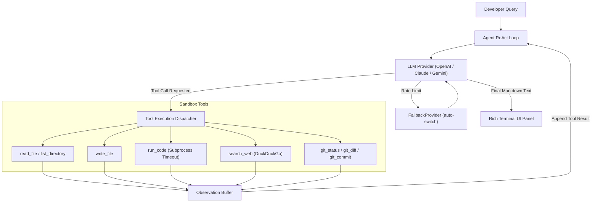

# ⚡ Nexus-Agent: Autonomous Agentic AI Coding Assistant

<div align="center">
  <p><strong>A production-grade, terminal-first AI Software Engineering Companion powered by autonomous ReAct tool loops and multi-provider backend switching.</strong></p>

  
  
  
  
  
  [](https://www.linkedin.com/in/yash-bajpai-b5a86332a/)
  
</div>

---

## 🎬 Live Demo Recording

https://github.com/user-attachments/assets/73e78850-8669-40e9-aec3-3a355e975c1f

---

## 🌟 Overview

**Nexus-Agent** is an autonomous command-line coding agent designed to pair-program with developers directly inside their local workspace. Built from the ground up to showcase modern **Agentic AI Engineering** principles, Nexus-Agent doesn't just generate text—it autonomously inspects files, modifies codebases, executes scripts inside secure local sandboxes, searches live web documentation, and inspects Git repositories.

Built with a clean **ReAct (Reasoning + Acting)** cognitive architecture, Nexus-Agent reasons step-by-step after every tool execution before deciding its next move.

---

## ❓ Why Nexus-Agent?

Unlike cloud-dependent tools like GitHub Copilot CLI, **Nexus-Agent** is built for offline-capable, cost-zero local execution. V2 will integrate a custom-trained 124M parameter LLM as the local backend — enabling completely private, zero-latency execution with no external API key required.

### 📊 How Nexus-Agent Compares

| Feature | Nexus-Agent | Copilot CLI | Cursor | Aider |
| :--- | :---: | :---: | :---: | :---: |
| **Multi-Provider Support** (Claude, Gemini, OpenAI) | ✅ | ❌ | ❌ | ✅ |
| **Auto-Provider Fallback** (rate limit resilient) | ✅ | ❌ | ❌ | ❌ |
| **Autonomous Local Tool Execution** | ✅ | ❌ | ✅ | ✅ |
| **Mobile / Android (Termux) Support** | ✅ | ❌ | ❌ | ⚠️ |
| **Real-Time Token & Cost Tracking** | ✅ | ❌ | ❌ | ❌ |
| **`@mention` File Context Injection** | ✅ | ❌ | ❌ | ❌ |
| **Smart Project vs. Global Detection** | ✅ | ❌ | ❌ | ❌ |
| **AI-Powered `agent commit`** | ✅ | ❌ | ❌ | ❌ |

---

## 🔥 Key Architectural Highlights

- 🧠 **Autonomous ReAct Loop**: Implements multi-step cognitive reasoning (`Thought → Action → Observation → Repeat`), allowing the agent to solve complex multi-file engineering tasks independently (up to 10 autonomous tool iterations per query).
- 🔌 **Universal Multi-Provider Backend**: Abstracted provider layer supporting seamless switching between industry-leading LLMs (`OpenAI GPT-4o`, `Anthropic claude-sonnet-4-6`, and `Google gemini-2.5-flash`).
- 🔄 **Auto-Provider Fallback**: `--provider auto` chains `gemini → anthropic → openai` and switches silently on rate limit or auth failure, with a clean `[WARN]` message.
- 💰 **Real-Time Dynamic Cost Tracker**: Live token computation engine that calculates exact input/output token expenditure and monetary cost in real time per session.
- 🚀 **First-Run Onboarding Wizard**: Auto-detects first launch, guides through API key setup, detects RAM/CPU/GPU specs, and suggests optimal local model for V2.
- 📱 **Full Mobile / Android (Termux) Support**: Optimized zero-dependency C-wheel exclusions and pure-Python `/proc/meminfo` RAM/CPU detection allow `pip install nexus-agent-ai` to run 100% natively on Android phones inside Termux without C-compilation errors.
- 🛠️ **Comprehensive Developer Toolset**:
  - `read_file`: Safely parses local file contents to prevent hallucinations.
  - `write_file`: Actively writes or overwrites code files with automatic directory creation.
  - `list_directory`: Recursively maps workspace architecture.
  - `run_code`: Executes arbitrary Python code inside isolated subprocesses with strict execution timeout enforcement (`CODE_EXECUTION_TIMEOUT = 10s`).
  - `search_web`: Queries live DuckDuckGo indexes for real-time API docs and error debugging.
  - `git_status`: Monitors uncommitted workspace changes and diff statistics.
  - `git_diff` + `git_commit`: Reads full staged diff and commits — powering `nexus-agent commit`.
- 🎨 **Rich Syntax-Highlighted UI**: Beautiful terminal display powered by `Rich`, featuring markdown rendering and ReAct trace badges (`[THINKING]`, `[ACTION]`, `[OBSERVE]`).
- ⚡ **Streaming CLI Response**: Interactive streaming text output with `--no-stream` toggle support.

---

## 🏗️ System Architecture

```
nexus-agent/
├── pyproject.toml               ← Package metadata & Typer binary entry point (`nexus-agent` / `agent`)
├── requirements.txt             ← Core dependencies (Typer, Rich, OpenAI, Anthropic, Gemini, DDGS)
├── .env.example                 ← Environment variable configuration template
└── src/
    ├── agent/
    │   ├── core.py              ← Autonomous ReAct agent loop & system instructions
    │   ├── memory.py            ← Sliding-window conversation buffer (max 20 turns)
    │   └── tools.py             ← Universal tool schema & execution handlers
    ├── cli/
    │   ├── app.py               ← Typer CLI command definitions (chat, repl, review, debug, generate, commit)
    │   ├── display.py           ← Rich terminal UI components & live cost tracking
    │   └── onboarding.py        ← First-run wizard (API keys, system spec detection, provider setup)
    ├── providers/
    │   ├── base.py              ← Abstract BaseProvider interface & RateLimitError
    │   ├── fallback_provider.py ← Auto-fallback chain (gemini → anthropic → openai)
    │   ├── openai_provider.py   ← OpenAI backend implementation
    │   ├── anthropic_provider.py ← Anthropic claude-sonnet-4-6 backend implementation
    │   └── gemini_provider.py   ← Google gemini-2.5-flash backend implementation
    └── utils/
        └── config.py            ← Environment loader & dynamic token cost calculator
```

### Cognitive ReAct Workflow



---

## 🚀 Getting Started

### 1. Installation

Install officially via PyPI across any desktop or server (Windows / macOS / Linux):
```bash
pip install nexus-agent-ai
```

#### 📱 Mobile / Android (Termux) Quickstart
Nexus-Agent is fully optimized to run on Android phones via **Termux** (`v2.2.6+`). It uses pure-Python spec detection (`/proc/meminfo`) and automatically skips C/Rust compilation dependencies (`psutil`, `jiter`, `pydantic-core`) by default:
```bash
# 1. Update Termux & install Python/Git
pkg update && pkg upgrade -y
pkg install python git -y

# 2. Install Nexus-Agent cleanly from PyPI (fast pure-Python install)
pip install --upgrade nexus-agent-ai

# 3. Launch from anywhere!
nexus-agent
```
*(Optional: If you explicitly want Claude (`anthropic`) or ChatGPT (`openai`) models inside Termux, run `pkg install rust python-pydantic -y` before installing via `pip install nexus-agent-ai[all]`)*

Or clone for local development:
```bash
git clone https://github.com/Yash1bajpai/nexus-agent.git
cd nexus-agent
pip install -e .
```

### 2. Initial Setup & User Guide

When you install `nexus-agent-ai`, getting started takes less than 30 seconds whether you choose **Local Offline Mode** (zero cost, private) or **Cloud Provider Mode** (Claude, OpenAI, Gemini).

#### A. First-Run Interactive Wizard (Automatic)
On your very first `nexus-agent` invocation from the terminal, the built-in **Interactive Onboarding Wizard** launches automatically:
```bash
nexus-agent
```
The wizard auto-detects your system specifications (CPU threads, total RAM, and GPU capabilities on Desktop or Termux), helps you choose a default provider (`local`, `gemini`, `anthropic`, or `openai`), and saves your preferences cleanly to a local `.env` file in your workspace or home directory (`~/.nexus_agent_initialized`).

#### B. Offline Local Model Download (`pull-model`)
Nexus-Agent includes built-in support for autonomous local reasoning (`LocalQwenProvider`) — allowing you to generate, review, and debug code completely offline with **zero API keys required**.

To download or verify the quantized reasoning model (`Qwen2.5-Coder` 4-bit AWQ / GGUF engine):
```bash
nexus-agent pull-model
```
*What this does:*
- Checks your system environment and verifies `huggingface_hub` availability.
- Downloads the optimized local quantized model weights (~4.5 GB) directly to your local cache (`~/.cache/huggingface/hub/...`).
- Validates model integrity (`verify_download=True`) and confirms readiness (`✅ Local Quantized Model Ready`).
- Once pulled, you can run offline any time using: `nexus-agent --provider local`.

#### C. Manual API Key Configuration (Cloud Providers)
If you prefer manual configuration or want to use cloud LLMs (`Anthropic Claude 3.5 Sonnet`, `OpenAI GPT-4o`, `Google Gemini 2.5 Flash`), copy the example environment file:
```bash
cp .env.example .env
```
Open `.env` and set your desired default provider and API keys:
```ini
DEFAULT_PROVIDER=gemini
GEMINI_API_KEY=AIzaSy...
ANTHROPIC_API_KEY=sk-ant-...
OPENAI_API_KEY=sk-proj-...
```

---

### 3. Top Starting Commands (Quick Reference)

Here are the essential commands every developer should try first:

#### ⚡ 1. Start Interactive Pair-Programming (REPL Mode)
Launch a continuous multi-turn coding session inside your current directory. Ask questions, mention files via `@filename`, and let the agent autonomously inspect and edit code:
```bash
nexus-agent
# Specify provider explicitly:
nexus-agent --provider anthropic
# Enable auto-switching fallback (gemini -> anthropic -> openai):
nexus-agent --provider auto
```

#### 💬 2. Instant One-Shot Coding Task (`chat`)
Execute a direct autonomous engineering instruction without entering REPL mode:
```bash
nexus-agent chat "Create a python script primes.py that generates the first 20 prime numbers and run it to verify." --provider gemini
```

#### 🔍 3. Read-Only Code Review (`review`)
Perform a strict read-only audit of any local code file to identify bugs, security vulnerabilities (`SQLi`, path traversal), and performance bottlenecks:
```bash
nexus-agent review src/utils/config.py --provider local
```

#### 🐞 4. Autonomous Error Traceback Repair (`debug`)
Paste any terminal traceback or error message directly into Nexus-Agent. The agent autonomously reads the problematic file, diagnoses the exact root cause, and applies the corrected fix via `write_file`:
```bash
nexus-agent debug src/app.py --error "ZeroDivisionError: float division by zero when response_times is empty"
```

#### 📝 5. Direct Code File Generation (`generate`)
Instruct the agent to write production-ready code directly to a target destination path:
```bash
nexus-agent generate "Create an async web scraper using aiohttp and BeautifulSoup" --output scraper.py
```

#### 📦 6. AI Conventional Git Commit (`commit`)
Analyze your staged or unstaged Git diff (`git diff`) and autonomously generate a concise conventional commit message (`feat:`, `fix:`, `refactor:`):
```bash
nexus-agent commit
# Skip confirmation and commit immediately:
nexus-agent commit --yes
```

---

### 4. Advanced Features & Trace Inspection

#### Verbose ReAct Trace Engine (`--verbose`)
See the agent's internal cognitive reasoning (`[THINKING] → [ACTION] → [OBSERVE]`) in real time across every tool execution loop:
```bash
nexus-agent chat "Refactor utils.py to use dataclasses" --verbose
```
```
[THINKING] I need to read the file first to understand the current structure
[ACTION]   read_file(path="utils.py")
[OBSERVE]  Done (0.1s) → class Config: | def load(): | ...
[THINKING] Now I'll rewrite using dataclasses and write_file
[ACTION]   write_file(path="utils.py", content="...")
[OBSERVE]  Done (0.0s) → Successfully wrote 847 characters to utils.py
```

#### `@mention` File Context Injection
Inside REPL mode or chat prompts, mention any file path using `@filename` (e.g. `@src/agent/core.py`). Nexus-Agent automatically attaches the file's exact contents cleanly into its context window before answering.

---

## 🧪 Testing & Verification

Nexus-Agent maintains a **100% passing automated regression & security test suite** (`28 unit tests`) covering all tool dispatchers, AST sandbox boundaries, streaming mechanics, and filesystem handlers:

```bash
pytest tests/ -v --tb=short
```

```text
============================= test session starts =============================
collecting ... collected 28 items

tests/test_audit_fixes.py::test_sandbox_check_blocks_bypass PASSED       [  3%]
tests/test_audit_fixes.py::test_search_web_offline_labeling PASSED       [  7%]
tests/test_audit_fixes.py::test_local_provider_setup_model_verify PASSED [ 10%]
tests/test_audit_fixes.py::test_agent_run_stream_true PASSED             [ 14%]
tests/test_audit_fixes.py::test_onboarding_env_file_path PASSED          [ 17%]
tests/test_local_provider.py::test_local_qwen_provider_init PASSED       [ 21%]
tests/test_local_provider.py::test_local_qwen_provider_convert_tools PASSED [ 25%]
tests/test_local_provider.py::test_local_qwen_provider_setup_model PASSED [ 28%]
tests/test_local_provider.py::test_local_qwen_format_tool_result_message PASSED [ 32%]
tests/test_providers.py::test_anthropic_provider_schema PASSED           [ 35%]
tests/test_providers.py::test_openai_provider_schema PASSED              [ 39%]
tests/test_providers.py::test_gemini_provider_schema PASSED              [ 42%]
tests/test_providers.py::test_provider_tool_result_format PASSED         [ 46%]
tests/test_providers.py::test_fallback_provider_general_exception PASSED [ 50%]
tests/test_tools.py::test_read_file_success PASSED                       [ 53%]
tests/test_tools.py::test_read_file_not_found PASSED                     [ 57%]
tests/test_tools.py::test_list_directory_success PASSED                  [ 60%]
tests/test_tools.py::test_list_directory_not_found PASSED                [ 64%]
tests/test_tools.py::test_search_web PASSED                              [ 67%]
tests/test_tools.py::test_write_file_success PASSED                      [ 71%]
tests/test_tools.py::test_run_code_success PASSED                        [ 75%]
tests/test_tools.py::test_git_status_tool PASSED                         [ 78%]
tests/test_tools.py::test_execute_tool_dispatcher PASSED                 [ 82%]
tests/test_tools.py::test_get_readonly_tools PASSED                      [ 85%]
tests/test_ux_features.py::test_parse_at_mentions PASSED                 [ 89%]
tests/test_ux_features.py::test_smart_startup_project_mode PASSED        [ 92%]
tests/test_ux_features.py::test_status_spinner_helpers PASSED            [ 96%]
tests/test_ux_features.py::test_sqlite_memory PASSED                     [100%]

============================= 28 passed in 5.13s ==============================
```

---

## 🛡️ Security & Sandbox Best Practices

- **Strict Secret Exclusion**: Verified `.gitignore` blocks `.env`, `.env.local`, and `.env.*.local`.
- **Subprocess Isolation**: Code execution (`run_code`) runs in dedicated subprocess threads with mandatory timeouts to prevent infinite loops.

---

<div align="center">
  <p>Engineered by <a href="https://github.com/Yash1bajpai">Yash Bajpai</a> · <a href="https://www.linkedin.com/in/yash-bajpai-b5a86332a/">LinkedIn</a></p>
</div>
