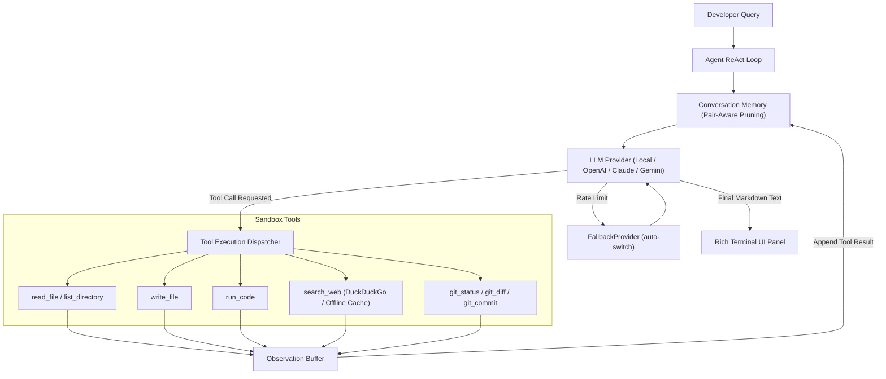

# ⚡ Nexus-Agent: Autonomous Agentic AI Coding Assistant

> [!WARNING]
> **The PyPI package name is `nexus-agent-ai`** (with `-ai`).
> `pip install nexus-agent` installs an unrelated empty placeholder by another author — that is **not** this project.
>
> ✅ `pip install nexus-agent-ai`

<div align="center">
  <p><strong>A production-grade, terminal-first AI Software Engineering Companion powered by autonomous ReAct tool loops and multi-provider backend switching.</strong></p>

  
  
  
  
  
  
  
  
  [](https://www.linkedin.com/in/yash-bajpai-b5a86332a/)
  
  
</div>

---

## 🎬 Live Demo Recording

https://github.com/user-attachments/assets/73e78850-8669-40e9-aec3-3a355e975c1f

---

## 🌟 Overview

**Nexus-Agent** is an autonomous command-line coding agent designed to pair-program with developers directly inside their local workspace. Built from the ground up to showcase modern **Agentic AI Engineering** principles, Nexus-Agent inspects files, modifies codebases, executes restricted pure-computation snippets, searches live web documentation, and inspects Git repositories.

Built with a clean **ReAct (Reasoning + Acting)** cognitive architecture, Nexus-Agent reasons step-by-step after every tool execution before deciding its next move.

---

## ❓ Why Nexus-Agent?

Unlike cloud-dependent tools like GitHub Copilot CLI, **Nexus-Agent** is built for offline-capable, cost-zero local execution. V2 will integrate a custom-trained 124M parameter LLM as the local backend — enabling completely private, zero-latency execution with no external API key required.

### 📊 How Nexus-Agent Compares

| Feature | Nexus-Agent | Copilot CLI | Cursor | Aider |
| :--- | :---: | :---: | :---: | :---: |
| **100% Offline Local Model** (Liquid AI LFM 2.6B) | ✅ | ❌ | ❌ | ❌ |
| **Multi-Provider Support** (Claude, Gemini, OpenAI) | ✅ | ❌ | ❌ | ✅ |
| **Auto-Provider Fallback** (rate limit resilient) | ✅ | ❌ | ❌ | ❌ |
| **Autonomous Local Tool Execution** | ✅ | ❌ | ✅ | ✅ |
| **Mobile / Android (Termux) Support** | ✅ | ❌ | ❌ | ⚠️ |
| **Real-Time Token & Cost Tracking** | ✅ | ❌ | ❌ | ❌ |
| **`@mention` File Context Injection** | ✅ | ❌ | ❌ | ❌ |
| **Smart Project vs. Global Detection** | ✅ | ❌ | ❌ | ❌ |
| **AI-Powered `agent commit`** | ✅ | ❌ | ❌ | ❌ |

---

## 🔥 Key Architectural Highlights

- 🧠 **Autonomous ReAct Loop**: Implements multi-step cognitive reasoning (`Thought → Action → Observation → Repeat`), allowing the agent to solve complex multi-file engineering tasks independently (up to 10 autonomous tool iterations per query).
- 🔌 **Universal Multi-Provider Backend**: Abstracted provider layer supporting seamless switching between industry-leading LLMs (`OpenAI GPT-4o`, `Anthropic claude-sonnet-4-6`, and `Google gemini-2.5-flash`).
- 🔄 **Auto-Provider Fallback**: `--provider auto` chains `gemini → anthropic → openai` and switches silently on rate limit or auth failure, with a clean `[WARN]` message.
- 💰 **Real-Time Dynamic Cost Tracker**: Live token computation engine that calculates exact input/output token expenditure and monetary cost in real time per session.
- 🚀 **First-Run Onboarding Wizard**: Auto-detects first launch, guides through API key setup, detects RAM/CPU/GPU specs, and suggests optimal local model for V2.
- 📱 **Full Mobile / Android (Termux) Support**: Optimized zero-dependency C-wheel exclusions and pure-Python `/proc/meminfo` RAM/CPU detection allow `pip install nexus-agent-ai` to run 100% natively on Android phones inside Termux without C-compilation errors.
- 🛠️ **Comprehensive Developer Toolset**:
  - `read_file`: Safely parses local file contents to prevent hallucinations.
  - `write_file`: Actively writes or overwrites code files with automatic directory creation.
  - `list_directory`: Recursively maps workspace architecture.
  - `run_code`: Executes arbitrary Python code inside isolated subprocesses with strict execution timeout enforcement (`CODE_EXECUTION_TIMEOUT = 10s`).
  - `search_web`: Queries live DuckDuckGo indexes for real-time API docs and error debugging.
  - `git_status`: Monitors uncommitted workspace changes and diff statistics.
  - `git_diff` + `git_commit`: Reads full staged diff and commits — powering `nexus-agent commit`.
- 🎨 **Rich Syntax-Highlighted UI**: Beautiful terminal display powered by `Rich`, featuring markdown rendering and ReAct trace badges (`[THINKING]`, `[ACTION]`, `[OBSERVE]`).
- ⚡ **Streaming CLI Response**: Interactive streaming text output with `--no-stream` toggle support.

---

## 🏗️ System Architecture

```
nexus-agent/
├── pyproject.toml               ← Package metadata & Typer binary entry point (`nexus-agent` / `agent`)
├── requirements.txt             ← Core dependencies (Typer, Rich, OpenAI, Anthropic, Gemini, DDGS)
├── .env.example                 ← Environment variable configuration template
└── src/
    └── nexus_agent_ai/
        ├── agent/
        │   ├── core.py              ← Autonomous ReAct agent loop & system instructions
        │   ├── memory.py            ← Sliding-window conversation buffer (max 20 turns)
        │   └── tools.py             ← Universal tool schema & execution handlers
        ├── cli/
        │   ├── app.py               ← Typer CLI command definitions (chat, repl, review, debug, generate, commit)
        │   ├── display.py           ← Rich terminal UI components & live cost tracking
        │   └── onboarding.py        ← First-run wizard (API keys, system spec detection, provider setup)
        ├── providers/
        │   ├── base.py              ← Abstract BaseProvider interface & RateLimitError
        │   ├── fallback_provider.py ← Auto-fallback chain (gemini → anthropic → openai)
        │   ├── openai_provider.py   ← OpenAI backend implementation
        │   ├── anthropic_provider.py ← Anthropic claude-sonnet-4-6 backend implementation
        │   ├── gemini_provider.py   ← Google gemini-2.5-flash backend implementation
        │   └── local_provider.py    ← Liquid AI LFM 2.6B local inference (llama-server)
        └── utils/
            └── config.py            ← Environment loader & dynamic token cost calculator
```

### Cognitive ReAct Workflow


```mermaid
graph TD
    User["Developer Query"] --> Core["Agent ReAct Loop"]
    Core --> Mem["Conversation Memory (Pair-Aware Pruning)"]
    Mem --> Provider["LLM Provider (Local / OpenAI / Claude / Gemini)"]
    Provider -->|Tool Call Requested| Dispatcher["Tool Execution Dispatcher"]
    Provider -->|Rate Limit| Fallback["FallbackProvider (auto-switch)"]
    Fallback --> Provider
    
    subgraph Sandbox Tools
        Dispatcher --> RF["read_file / list_directory"]
        Dispatcher --> WF["write_file"]
        Dispatcher --> RC["run_code"]
        Dispatcher --> WEB["search_web (DuckDuckGo / Offline Cache)"]
        Dispatcher --> GIT["git_status / git_diff / git_commit"]
    end
    
    RF --> Obs["Observation Buffer"]
    WF --> Obs
    RC --> Obs
    WEB --> Obs
    GIT --> Obs
    
    Obs -->|Append Tool Result| Mem
    Provider -->|Final Markdown Text| UI["Rich Terminal UI Panel"]
```

---

## 🔄 How It Works (User Flow)

Getting productive with Nexus-Agent takes exactly three steps:

```
1. pip install nexus-agent-ai
            ↓
2. Choose your backend:
   • Local (free, offline):  nexus-agent pull-model   ← downloads Liquid AI LFM 2.6B
   • Cloud (API key):        set GEMINI / OPENAI / ANTHROPIC key in .env
            ↓
3. Start working — the agent autonomously handles:
   • 🔍 Web search      (search_web — live docs & error lookups)
   • 🐞 Debugging       (reads your traceback, finds the bug)
   • 🔧 Fixing errors   (applies the fix via write_file)
   • 📖 Reading files   (read_file, @mention context injection)
   • ✍️ Writing files   (creates/modifies code in your workspace)
   • 📂 Project tours   (list_directory, git_status, git_diff, git_commit)
```

No extra configuration needed — pick a backend and start asking. Example sessions:

```bash
# Offline with the local Liquid AI model:
nexus-agent -p local "read main.py and fix the import error"

# With a cloud key:
nexus-agent -p gemini "search web for the latest requests library API and write a demo script"
```

---

## 🚀 Getting Started

### 1. Installation

Install officially via PyPI across any desktop or server (Windows / macOS / Linux):
```bash
pip install nexus-agent-ai
```

#### 📱 Mobile / Android (Termux) Quickstart
Nexus-Agent is fully optimized to run on Android phones via **Termux** (`v2.2.6+`). It uses pure-Python spec detection (`/proc/meminfo`) and automatically skips C/Rust compilation dependencies (`psutil`, `jiter`, `pydantic-core`) by default:
```bash
# 1. Update Termux & install Python/Git
pkg update && pkg upgrade -y
pkg install python git -y

# 2. Install Nexus-Agent cleanly from PyPI (fast pure-Python install)
pip install --upgrade nexus-agent-ai

# 3. Launch from anywhere!
nexus-agent
```
*(Optional: If you explicitly want Claude (`anthropic`) or ChatGPT (`openai`) models inside Termux, run `pkg install rust python-pydantic -y` before installing via `pip install nexus-agent-ai[all]`)*

#### 🪟 Windows Setup & Troubleshooting Guide
If installing or running on Windows 10/11, here are standard resolutions for common Windows & PyPI edge cases:

1. **PowerShell Script Execution Restriction (`PSSecurityException`)**:
   If activating a virtual environment (`venv\Scripts\activate`) fails due to script execution policies, run this in PowerShell:
   ```powershell
   Set-ExecutionPolicy -ExecutionPolicy RemoteSigned -Scope Process
   ```
2. **File-Locking Bug (`[WinError 2] .deleteme`)**:
   If upgrading global dependencies triggers Windows binary file-locking errors, upgrade `pip` first:
   ```powershell
   python -m pip install --upgrade pip
   ```
3. **Executable PATH Isolation Warning (`CommandNotFoundException`)**:
   If `nexus-agent` is not recognized because `AppData\Roaming\Python\Scripts` is not on system `PATH`, launch directly via Python module invocation:
   ```powershell
   python -m nexus_agent_ai
   ```
4. **Official PyPI Package Identifier**:
   Ensure you install using the exact PyPI package name **`nexus-agent-ai`**:
   ```powershell
   pip install nexus-agent-ai
   ```


Or clone for local development:
```bash
git clone https://github.com/Yash1bajpai/nexus-agent.git
cd nexus-agent
pip install -e .
```

### 2. Initial Setup & User Guide

When you install `nexus-agent-ai`, getting started takes less than 30 seconds whether you choose **Local Offline Mode** (zero cost, private) or **Cloud Provider Mode** (Claude, OpenAI, Gemini).

#### A. First-Run Interactive Wizard (Automatic)
On your very first `nexus-agent` invocation from the terminal, the built-in **Interactive Onboarding Wizard** launches automatically:
```bash
nexus-agent
```
The wizard auto-detects your system specifications (CPU threads, total RAM, and GPU capabilities on Desktop or Termux), helps you choose a default provider (`local`, `gemini`, `anthropic`, or `openai`), **checks and installs the llama-server inference engine automatically**, and saves your preferences cleanly to a local `.env` file in your workspace or home directory (`~/.nexus_agent_initialized`).

#### B. Offline Local Model (Liquid AI LFM 2.6B)
Nexus-Agent includes a built-in **Liquid AI LFM 2.6B** local model (`LocalProvider`) — allowing you to generate, review, and debug code completely offline with **zero API keys required**.

To download or verify the model (`LiquidAI/LFM2.5-2.6B-GGUF`, Q6_K quantization, ~2 GB):
```bash
nexus-agent pull-model
```

**Pull any HuggingFace GGUF model** (verified examples):
```bash
# Qwen2.5 Coder 3B
nexus-agent pull-model --repo Qwen/Qwen2.5-Coder-3B-Instruct-GGUF --file qwen2.5-coder-3b-instruct-q4_k_m.gguf

# Mistral 7B (16GB+ RAM)
nexus-agent pull-model --repo bartowski/Mistral-7B-Instruct-v0.3-GGUF --file Mistral-7B-Instruct-v0.3-Q4_K_M.gguf

# TinyLlama 1.1B (low-RAM devices)
nexus-agent pull-model --repo TheBloke/TinyLlama-1.1B-Chat-v1.0-GGUF --file tinyllama-1.1b-chat-v1.0.Q4_K_M.gguf
```
Then make it your default by adding to `~/.nexus-agent/.env`:
```ini
NEXUS_AGENT_MODEL_REPO=Qwen/Qwen2.5-Coder-3B-Instruct-GGUF
NEXUS_AGENT_MODEL_FILENAME=qwen2.5-coder-3b-instruct-q4_k_m.gguf
```

**Hardware-aware auto-configuration:** on first run, the onboarding wizard detects your RAM, GPU, and platform, then automatically writes the safest model quantization for your machine to `~/.nexus-agent/.env` — Q4_0 on phones/low-RAM, Q4_K_M up to 8GB, Q5_K_M up to 16GB, Q6_K above. It also prints the exact `pull-model` command for bigger models when your hardware can handle them.
nexus-agent-ai installs local mode by default. Cloud providers and live web search are optional integrations; install `nexus-agent-ai[all,web]` only when those SDKs are available on your platform.
Automatic llama-server downloads are verified against pinned official SHA-256 digests of the llama.cpp `b7075` release and fail closed on mismatch (no configuration needed). Advanced users can override the digest with `NEXUS_AGENT_LLAMA_SERVER_SHA256`. On Termux/ARM, build a native llama-server locally and set `NEXUS_AGENT_MODEL_FILENAME` to a phone-safe quant such as `LFM2.5-2.6B-Q4_K_M.gguf`.

**Engine pre-flight (v2.7.1+):** the llama-server engine is checked at the initial stage — during first-run onboarding and before every local-provider session. If it is missing, the ~50 MB download starts automatically *before* your query runs, so the LFM model never fails mid-chat because of an uninstalled engine.
*What this does:*
- Downloads the Liquid AI LFM 2.6B post-trained agentic model to your local HuggingFace cache (`~/.cache/huggingface/hub/...`).
- Validates model integrity and confirms readiness.
- Once pulled, run offline anytime: `nexus-agent -p local "your question"`

**Smart Tool Routing (v2.6.0+):**
The local model uses intelligent tool routing. For simple questions (math, explanations, facts), it answers directly without tools. For coding tasks (reading/writing files, running code, git, web search), it automatically enables the full toolset. This keeps the small local model focused and prevents tool-call looping.

#### C. Manual API Key Configuration (Cloud Providers)
If you prefer manual configuration or want to use cloud LLMs (`Anthropic Claude 3.5 Sonnet`, `OpenAI GPT-4o`, `Google Gemini 2.5 Flash`), copy the example environment file into the user-owned config directory:
```bash
mkdir -p ~/.nexus-agent
cp .env.example ~/.nexus-agent/.env
```
Open `.env` and set your desired default provider and API keys:
```ini
DEFAULT_PROVIDER=gemini
GEMINI_API_KEY=AIzaSy...
ANTHROPIC_API_KEY=sk-ant-...
OPENAI_API_KEY=sk-proj-...
```

---

### 2.5 Complete Setup Guide (Step-by-Step)

New to Nexus-Agent? Follow this complete walkthrough to get running in under 5 minutes:

**Step 1: Install the package**
```bash
pip install nexus-agent-ai
```

**Step 2: Choose your mode**

| Mode | Command | Best For |
|------|---------|----------|
| **Local (no API key)** | `nexus-agent -p local` | Offline, private, free |
| **Gemini (free tier)** | `nexus-agent -p gemini` | Cloud quality, free quota |
| **Claude/OpenAI** | `nexus-agent -p anthropic` | Premium quality |
| **Auto-fallback** | `nexus-agent -p auto` | Maximum reliability |

**Step 3: Run your first command**
```bash
# Interactive mode (REPL)
nexus-agent

# One-shot task
nexus-agent chat "Create a Flask API with a /health endpoint"

# Code review
nexus-agent review my_script.py
```

**Step 4: (Optional) Download local model for offline use**
```bash
nexus-agent pull-model
```
This downloads the Liquid AI LFM 2.6B model (~2 GB). Once downloaded, you can use `-p local` without internet.

---

### 2.6 Tips & Suggestions

**Faster model downloads with HuggingFace token:**
The local model downloads from HuggingFace. For faster speeds and higher rate limits, set a free HF token:

```bash
# Get your free token at https://huggingface.co/settings/tokens
# Then add to your .env file:
HF_TOKEN=hf_xxxxxxxxxxxxxxxxxxxx
```

With a token, download speeds can improve significantly and you avoid anonymous rate limits.

**Ollama as an alternative local backend:**
If `llama-server` fails on your system (common on college/corporate networks), install [Ollama](https://ollama.com) instead:

```bash
# 1. Install Ollama from https://ollama.com
# 2. Pull a coding model:
ollama run llama3.2:3b

# 3. Use with nexus-agent:
nexus-agent -p ollama "your question"
```

**PATH issues on Windows?**
If `nexus-agent` command is not found, use Python module invocation instead:
```powershell
python -m nexus_agent_ai
```
This always works without manual PATH setup.

**Firewall/antivirus blocking downloads?**
If `llama-server` download fails:
1. Download manually from the [llama.cpp releases page](https://github.com/ggml-org/llama.cpp/releases)
2. Extract to `~/.nexus-agent/llama-server/`
3. Or use `-p ollama` or `-p gemini` as alternatives

---

### 3. Top Starting Commands (Quick Reference)

Here are the essential commands every developer should try first:

#### ⚡ 1. Start Interactive Pair-Programming (REPL Mode)
Launch a continuous multi-turn coding session inside your current directory. Ask questions, mention files via `@filename`, and let the agent autonomously inspect and edit code:
```bash
nexus-agent
# Specify provider explicitly:
nexus-agent --provider anthropic
# Enable auto-switching fallback (gemini -> anthropic -> openai):
nexus-agent --provider auto
```

#### 💬 2. Instant One-Shot Coding Task (`chat`)
Execute a direct autonomous engineering instruction without entering REPL mode:
```bash
nexus-agent chat "Create a python script primes.py that generates the first 20 prime numbers and run it to verify." --provider gemini
```

#### 🔍 3. Read-Only Code Review (`review`)
Perform a strict read-only audit of any local code file to identify bugs, security vulnerabilities (`SQLi`, path traversal), and performance bottlenecks:
```bash
nexus-agent review src/nexus_agent_ai/utils/config.py --provider local
```

#### 🐞 4. Autonomous Error Traceback Repair (`debug`)
Paste any terminal traceback or error message directly into Nexus-Agent. The agent autonomously reads the problematic file, diagnoses the exact root cause, and applies the corrected fix via `write_file`:
```bash
nexus-agent debug src/nexus_agent_ai/cli/app.py --error "ZeroDivisionError: float division by zero when response_times is empty"
```

#### 📝 5. Direct Code File Generation (`generate`)
Instruct the agent to write production-ready code directly to a target destination path:
```bash
nexus-agent generate "Create an async web scraper using aiohttp and BeautifulSoup" --output scraper.py
```

#### 📦 6. AI Conventional Git Commit (`commit`)
Analyze your staged or unstaged Git diff (`git diff`) and autonomously generate a concise conventional commit message (`feat:`, `fix:`, `refactor:`):
```bash
nexus-agent commit
# Skip confirmation and commit immediately:
nexus-agent commit --yes
```

---

### 4. Advanced Features & Trace Inspection

#### Verbose ReAct Trace Engine (`--verbose`)
See the agent's internal cognitive reasoning (`[THINKING] → [ACTION] → [OBSERVE]`) in real time across every tool execution loop:
```bash
nexus-agent chat "Refactor utils.py to use dataclasses" --verbose
```
```
[THINKING] I need to read the file first to understand the current structure
[ACTION]   read_file(path="utils.py")
[OBSERVE]  Done (0.1s) → class Config: | def load(): | ...
[THINKING] Now I'll rewrite using dataclasses and write_file
[ACTION]   write_file(path="utils.py", content="...")
[OBSERVE]  Done (0.0s) → Successfully wrote 847 characters to utils.py
```

#### `@mention` File Context Injection
Inside REPL mode or chat prompts, mention any file path using `@filename` (e.g. `@src/nexus_agent_ai/agent/core.py`). Nexus-Agent automatically attaches the file's exact contents cleanly into its context window before answering.

---

## 🧪 Testing & Verification

Nexus-Agent maintains an automated regression and security test suite covering tool dispatchers, restricted code execution, streaming mechanics, provider mocking, and filesystem handlers:

```bash
pytest tests/ -v --tb=short
```

```text
============================= test session starts =============================
collecting ... collected 36 items

tests/test_audit_fixes.py::test_sandbox_check_blocks_bypass PASSED       [  2%]
tests/test_audit_fixes.py::test_sandbox_check_blocks_introspection_and_gc PASSED [  5%]
tests/test_audit_fixes.py::test_sandbox_check_allows_safe_dunders PASSED   [  8%]
tests/test_audit_fixes.py::test_validate_workspace_path_prefix_containment PASSED [ 11%]
tests/test_audit_fixes.py::test_execute_run_file_is_disabled PASSED
tests/test_audit_fixes.py::test_memory_pruning_user_boundaries PASSED    [ 16%]
tests/test_audit_fixes.py::test_search_web_offline_labeling PASSED       [ 19%]
tests/test_audit_fixes.py::test_local_provider_setup_model_verify PASSED [ 22%]
tests/test_audit_fixes.py::test_agent_run_stream_true PASSED             [ 25%]
tests/test_audit_fixes.py::test_onboarding_env_file_path PASSED          [ 27%]
tests/test_local_provider.py::test_local_provider_init PASSED            [ 30%]
tests/test_local_provider.py::test_local_provider_convert_tools PASSED     [ 33%]
tests/test_local_provider.py::test_local_provider_setup_model PASSED       [ 36%]
tests/test_local_provider.py::test_local_provider_format_tool_result_message PASSED [ 38%]
tests/test_providers.py::test_anthropic_provider_schema PASSED           [ 41%]
tests/test_providers.py::test_openai_provider_schema PASSED              [ 44%]
tests/test_providers.py::test_gemini_provider_schema PASSED              [ 47%]
tests/test_providers.py::test_provider_tool_result_format PASSED         [ 50%]
tests/test_providers.py::test_fallback_provider_general_exception PASSED [ 52%]
tests/test_providers.py::test_anthropic_complete_and_stream PASSED       [ 55%]
tests/test_providers.py::test_openai_complete_and_stream PASSED          [ 58%]
tests/test_providers.py::test_gemini_complete_and_stream PASSED          [ 61%]
tests/test_tools.py::test_read_file_success PASSED                       [ 63%]
tests/test_tools.py::test_read_file_not_found PASSED                     [ 66%]
tests/test_tools.py::test_list_directory_success PASSED                  [ 69%]
tests/test_tools.py::test_list_directory_not_found PASSED                [ 72%]
tests/test_tools.py::test_search_web PASSED                              [ 75%]
tests/test_tools.py::test_write_file_success PASSED                      [ 77%]
tests/test_tools.py::test_run_code_success PASSED                        [ 80%]
tests/test_tools.py::test_git_status_tool PASSED                         [ 82%]
tests/test_tools.py::test_execute_tool_dispatcher PASSED                 [ 85%]
tests/test_tools.py::test_get_readonly_tools PASSED                      [ 88%]
tests/test_ux_features.py::test_parse_at_mentions PASSED                 [ 91%]
tests/test_ux_features.py::test_smart_startup_project_mode PASSED        [ 94%]
tests/test_ux_features.py::test_status_spinner_helpers PASSED            [ 97%]
tests/test_ux_features.py::test_sqlite_memory PASSED                     [100%]

============================= 41 passed ==============================
```

---

## 🛡️ Security & Sandbox Best Practices

- **Strict Secret Exclusion**: Verified `.gitignore` blocks `.env`, `.env.local`, and `.env.*.local`.
- **AST Sandbox with Safe-Dunder Allowlist**: The `run_code` sandbox uses AST static analysis to block dangerous imports (`os`, `subprocess`, `socket`, `importlib`, etc.), execution calls (`exec`, `eval`, `compile`, `open`, `__import__`), and introspection attributes (`__class__`, `__bases__`, `__mro__`, `__globals__`, `__builtins__`). Safe dunders (`__name__`, `__main__`, `__file__`, `__str__`, `__repr__`, `__len__`, `__eq__`) are explicitly allowed so standard Python patterns like `if __name__ == "__main__":` are not blocked.
- **Subprocess Isolation**: Code execution (`run_code`) runs in dedicated subprocess threads with mandatory timeouts to prevent infinite loops.
- **GitHub Actions CI**: Automated Python 3.11/3.12/3.13 matrix testing on every push and PR — no manual QA gates needed.

---

## 📜 License

Nexus-Agent is released under the [MIT License](LICENSE) — free to use, modify, and distribute.

The local backend uses the [Liquid AI LFM 2.5-2.6B](https://huggingface.co/LiquidAI/LFM2.5-2.6B-GGUF) model, which is distributed by Liquid AI under its own license terms on HuggingFace.

---

<div align="center">
  <p>Engineered by <a href="https://github.com/Yash1bajpai">Yash Bajpai</a> · <a href="https://www.linkedin.com/in/yash-bajpai-b5a86332a/">LinkedIn</a></p>
</div>
